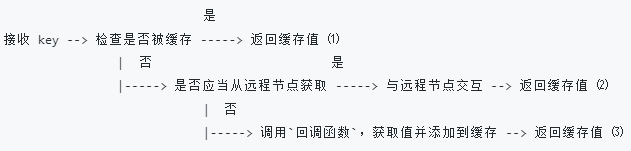

# 分布式缓存系统设计
在第一次请求一个资源时，将一些耗时的结果缓存下来，下一次遇到相同的请求就可以直接返回暂存的数据。在计算机的系统中缓存系统很常见，例如访问一个网页，网页和引用的 JS/CSS 等静态文件，根据不同的策略，会缓存在浏览器本地或是 CDN 服务器，那在第二次访问的时候，就会觉得网页加载的速度快了不少。或者有一些针对数据库的操作，比较耗时且数据库也无法支持巨大的流量，所以会将查询结果缓存起来，例如缓存在 Redis 服务器群中。 缓存中最基本的方式就是 key - value 形式的缓存。我们可以创建一个 map 用于保存缓存数据，但是这样有几个问题需要解决：

map 缓存的数据是在内存中的，如果内存不够了如何解决？

真实场景中对于缓存的访问几乎都是并发的，如何保证并发写入的安全？

单台计算机的资源是有限的，如何利用多台物理计算机的资源？

分布式缓存系统需要考虑资源的控制、缓存淘汰的策略、并发、分布式节点间的通信等等。这些需要考虑的问题会随着场景的变化而变化，很难找到一套通用的分布式缓存系统设计方案。这里分布式缓存系统的设计参考了 groupcache 的设计。实现的功能有：

单级缓存

基于 HTTP 的分布式缓存

LRU 缓存淘汰策略

使用 Go 锁机制防止缓存击穿

使用一致性哈希选择节点，实现负载均衡

使用 protobuf 优化节点间的二进制通信、

## 一、LRU 淘汰策略实现
在实现 LRU 之前先说说为什么需要缓存淘汰策略。为了缓存查询的效率等考虑，缓存一般是缓存在内存中的，但是内存是有限的，当缓存达到了内存的上限，需要删除一些缓存数据。这个时候删除哪些数据是一个需要考虑的问题，最好的方式就是删除最没用的数据，所以缓存淘汰策略的目的就是找到这些没用的数据并从缓存中删除。但是这个没用的数据在不同的场景下定义是不同的。需要结合具体的场景来考虑。

#### 1、先进先出 FIFO
这是一个非常经典的算法，FIFO 会淘汰最先添加的记录。这种策略认为最早添加的记录不再被访问的可能性较大，最后添加的记录被访问的可能性较大。这种算法的实现就是使用一个队列，每当内存不够是，弹出队首记录。但是在某些场景下，最早添加的可能也是最常被访问的，所以使用 FIFO 策略会导致缓存的命中率降低。

#### 2、最少使用 LFU
LFU 会淘汰缓存中访问评率最低的记录。LFU 认为某个数据在过去被访问的频率较高，则在将来访问的频率也会比较高。因此 LFU 的实现需要维护一个按照访问频率排序的队列，每次访问后将对应记录的频率 + 1 并重新排序。淘汰时选择频率最低的数据删除即可。 LFU 的命中率比较高，但是缺点也很明显，需要额外维护一个访问频率，且每次访问完成之后都要对频率进行修改和重新排序。另外 LFU 容易收到历史记录的影响，如果业务发生变更，导致之前被频繁访问的数据现在很少被访问了，但是由于之前累积的频率已经很高了导致这条记录很久才能被淘汰。

#### 3、最近最少使用 LRU
这是我们的分布式缓存系统准备实现的淘汰策略。其实 LRU 是 FIFO 和 LFU 的一种折中考虑。 LRU 认为如果数据最近被访问过，那么将来被访问的频率也会比较高。LRU 的实现是采用一个队列，如果某个记录被访问了，就移动到队尾，在淘汰数据时删除队首元素即可。

算法实现：采用一个双向列表来存放值，采用一个 map 来存储键和值的映射关系。双向链表中移动元素、队尾新增元素和删除元素都是 O(1) 的时间复杂度。map 中新增一个键值对和查询一个值的时间复杂度也是 O(1)。由于双向链表只存储值，键和值的映射关系由 map 保存，所以在双向链表中值插入的位置不用特殊考虑。

首先定义键值对的结构。为了通用性，允许值是实现 Value 接口的任意类型，该接口只包含了一个方法 Len() int，用于返回值所占用的内存大小。

    type node struct {
        key   string
        value Value
    }

    type Value interface {
        Len() int
    }

然后采用 LRU 策略实现 CacheLRU，采用 LRU 策略所以首先要有 双向链表和 map。其次要有两个值保存 cache 可使用的最大缓存空间和目前已用的空间。最后要有一个当某个记录被删除时调用的回调函数。

    type CacheLRU struct {
        maxBytes  int64                         // 允许使用的最大内存
        nbytes    int64                         // 当前已使用的内存
        ll        *list.List                    // 使用 Go 语言标准库实现的双向链表list.List
        cacheMap  map[string]*list.Element      // 维护一个map， 键是字符串，值是双向链表中对应节点的指针
        OnEvicted func(key string, value Value) // 某条记录被移除时的回调函数
    }

实例化一个对象的函数如果没有特殊点需要说明就不再单独说明了。接下来就是要实现查询、新增、删除缓存操作了。

**_查询操作的实现_** ：分两步，第一步是根据传入的 key 找到对应的双向链表的节点值，也就是之前定义的 node 结构。第二步就是使用双向列表的方法: MoveToBack(elem) 把这个节点移动到双向链表的末尾，双向链表作为队列使用，队首和队尾是相对的，在这里规定 Back() 为队尾。

    func (c *CacheLRU) Find(key string) (value Value, ok bool)

**_删除操作的实现_** ：队首元素是我们要移除的元素。逻辑是首先通过 Front() 拿到队首元素 elem，然后用 Remove(elem) 从双向列表中删除这个元素。从链表中删除这个节点之后还需要从 map 中删除这个记录。利用 elem.Value 拿到节点的值并强制转化为 node 结构。然后使用 delete(map, key) 删除这条记录。最后更新内存使用情况，更新 cache 的 nbytes 字段值。

cache 中有个回调函数，如果回调函数不是 nil 则调用回调函数，在这里可以做一些针删除的这个节点的一些额外工作。

    func (c *CacheLRU) Remove() 

**_新增节点的实现_** ：将数据添加到缓存中。在添加的时候需要考虑记录是否已经存在和内存是否会超限。如果节点已经存在了，那就修改这个节点并将这个节点移动到双向链表的末尾。如果不存在则创建节点并添加到队尾，同时在 cacheMap 中记录映射关系。如果添加后超过了内存的最大值限制则调用 remove 来删除节点。一般 maxBytes 不会设置为内存的大小，会留有一定的冗余空间。

    func (c *CacheLRU) Add(key string, value Value)

最后实现一个获取缓存中已经存在的记录的数量的函数。ll.Len()

分别对查询、删除、回调函数做单元测试。 

删除的逻辑是设置缓存的上限是前两个键值对的大小，然后添加前两个键值对，最后再添加一个键值对，看是否会将第一个键值对弹出。

    func TestCache_Remove(t *testing.T) {
        k1, k2, k3 := "key1", "key2", "k3"
        v1, v2, v3 := "value1", "value2", "v3"
        cap := len(k1 + k2 + v1 + v2)
        //fmt.Printf("cap = %v\n", cap) // cap = 20
        lru := New(int64(cap), nil)
        lru.Add(k1, String(v1))
        lru.Add(k2, String(v2))
        lru.Add(k3, String(v3))
        if _, ok := lru.Find("key1"); ok || lru.GetRecord() != 2 {
            t.Fatalf("Removeoldest key1 failed")
        }
        fmt.Printf("")
    }

回调函数的单元测试如下，检查是否会将最先加入的两个删除。

    func TestOnEvicted(t *testing.T) {
        keys := make([]string, 0)
        callback := func(key string, value Value) {
            // 把移除的节点的值保存起来放在后面进行对比
            keys = append(keys, key)
        }
        lru := New(int64(10), callback)
        // 第一个键值对就将缓存沾满了。
        lru.Add("key1", String("123456"))
        // 弹出 key1
        lru.Add("k2", String("k2"))
        lru.Add("k3", String("k3"))
        // 弹出 k2
        lru.Add("k4", String("k4"))
        // 检查是否弹出 key1 和 k2
        expect := []string{"key1", "k2"}
        
        if !reflect.DeepEqual(expect, keys) {
            t.Fatalf("Call OnEvicted failed, expect keys equals to %s", expect)
        }
    }

## 二、单机并发安全缓存
多个协程同时读写一个变量在并发度较高的情况下会发生冲突，确保一次只有一个协程可以访问该变量来避免冲突。

sync.Mutex 是 Go 语言标准库提供的一个互斥锁，当一个协程(goroutine)获得了这个锁的拥有权后，其它请求锁的协程(goroutine) 就会阻塞在 Lock() 方法的调用上，直到调用 Unlock() 锁被释放。

首先定义一个 ByteView 结构来表示一个缓存的值，这个值是 []byte 类型的，会存储真实的缓存值，使用 byte 是为了能够保存任意类型的数据。既然作为缓存值，那么就要实现之前在 node 中定义的缓存键值对中 值的 value 接口的方法。方法的内容就是返回 b 的长度。

    type ByteView struct {
        b []byte // 存储真实的缓存值，选择 byte 类型是为了能够支持任意的数据类型的存储
    }

为了防止缓存被外部程序修改，这里提供一个能够获取 b 的拷贝副本的方法。使用 copy 来获取一个 b 的副本并返回。

    func cloneBytes(b []byte) []byte {
        c := make([]byte, len(b))
        copy(c, b)
        return c
    }

    // b 是只读的，使用 ByteSlice() 方法返回一个拷贝，防止缓存值被外部程序修改
    func (v ByteView) ByteSlice() []byte {
        return cloneBytes(v.b)
    }

提供一个将 []byte 类型转化为字符串类型的方法，便于用户使用。

    func (v ByteView) String() string {
        return string(v.b)
    }

接下来在 cache.go 中定义一个 cache 结构，并实例化一个 使用 LRU 策略的缓存，这个 cache 是单机的缓存，后续会在分布式缓存中被复用。同时会在这里添加对于并发安全的支持。

    type cache struct {
        mu         sync.Mutex
        lru        *lru.CacheLRU // 采用 LRU 策略
        cacheBytes int64         // 最大的缓存空间
    }
 给 cache 对象添加 新增缓存数据和查询缓存数据的方法。

新增缓存数据其实就是对 LRU 的 ADD() 方法的封装，逻辑也很简单：如果 cache 的 lru 字段为空，那就创建一个使用 LRU 策略的缓存结构并调用 LRU 策略的 Add(key, value) 方法添加缓存数据。整个过程都是在 sync.Mutex 锁下完成的。

    func (c *cache) add(key string, value ByteView)

查询缓存数据的方法是对 LRU 的 Find() 方法的封装，逻辑和新增缓存数据一样。

    func (c *cache) find(key string) (value ByteView, ok bool)

接下来就是对核心的 Group 数据结构，也是分布式缓存系统的核心数据结构。Group 核心的数据结构，负责与用户的交互，并且控制缓存值存储和获取的流程。

    type Group struct {
        name      string    // 每个 Group 拥有一个唯一的名称 name
        getter    Getter    // 缓存未命中时获取源数据的回调(callback)
        mainCache cache     // 采用 LRU 实现的单机并发安全缓存
    }

为什么要用 Group 命名呢？因为一个 Group 是一个缓存命名空间和相关的数据加载分布，比如在创建缓存的时候指定 name 为 area 的缓存保存位置信息，name 为 money 的缓存保存价格信息等。在发起查询请求时会携带 Group name 的信息。后续的一些功能都会在 Group 上进行迭代。

添加创建 Group 的功能和 获取指定 name 的 Group。创建 Group 需要加读写锁，获取指定 name 的 Group 只需要加读写即可。

    func NewGroup(name string, cacheBytes int64, getter Getter) *Group
    func GetGroup(name string) *Group

设计 Get 方法从指定的 Group 中获取缓存。在获取之前先来梳理一下分布式缓存系统中查询一个缓存的简单流程。由于目前为止实现的是单机缓存，所以在这里要实现 (1) 和 (3) 的流程。

### 1、实现 (1) 和 (3)

定义一个当缓存数据不存在时，从本地获取数据的方法，这个方法会调用回调函数从数据源获取数据。但是数据源的种类非常多，可能是文件也可能是数据库等。所以数据源的配置这件事应该交给用户来做，设计了、一个回调函数(callback)，在缓存不存在时，调用这个函数，得到源数据。

定义一个 Getter 接口，要求实现 Get 函数从数据源获取数据。

    type Getter interface {
        Get(key string) ([]byte, error)
    }

定义一个函数类型 GetterFunc 这个函数类型

    type GetterFunc func(key string) ([]byte, error)

接下来让这个函数实现这个接口的方法。

    func (f GetterFunc) Get(key string) ([]byte, error) {
        return f(key)
    }

这里使用了一个接口型函数。函数类型实现某一个接口，称之为接口型函数，方便使用者在调用时既能够传入函数作为参数，也能够传入实现了该接口的结构体作为参数。这种方式适用于只有一个函数的接口。

定义 getLocally 函数，用于使用回调函数从数据源获取数据并将数据添加到缓存 mainCache  中。对应 (3) 的路径。

    func (g *Group) getLocally(key string) (ByteView, error) {
        bytes, err := g.getter.Get(key)
        if err != nil {
            return ByteView{}, err
        }
        value := ByteView{b: cloneBytes(bytes)}
        // 通过 populateCache 方法将源数据添加到缓存 mainCache 中
        g.populateCache(key, value)
        return value, nil
    }

这里为路径 (2) 预留一个方法 load。在这个方法实现的功能是从其他节点获取数据和从本地获取数据。目前这里只实现从本地获取数据，也就是调用 getLocally() 方法。

    func (g *Group) load(key string) (value ByteView, err error)

接下来就是实现核心的 Get 方法了。Get 的逻辑很简单，就是通过 key 从缓存中获取数据并返回。如果该缓存不存在，则调用 load() 方法从远程或者本地获取数据。目前还没有实现到分布式节点，所以 load () 方法中只有从本地获取数据的功能。

    func (g *Group) Get(key string) (ByteView, error) {
        // 如果 key 是空的
        if key == "" {
            return ByteView{}, fmt.Errorf("key is required")
        }
        // 如果查找到了,返回缓存
        if v, ok := g.mainCache.find(key); ok {
            log.Println("[Cache] hit")
            return v, nil
        }
        // 没查找到，调用load方法
        return g.load(key)
    }

进行测试：首先使用一个 map 来模拟一个耗时的数据库。

    var db = map[string]string{
        "Tom":  "630",
        "Jack": "589",
        "Sam":  "567",
    }

测试代码测试两种情况：

1）在缓存为空的情况下，能够通过回调函数获取到源数据。

2）在缓存已经存在的情况下，是否直接从缓存中获取，为了实现这一点，使用 loadCounts 统计某个键调用回调函数的次数，如果次数大于1，则表示调用了多次回调函数，没有缓存。

创建缓存时的回调函数如下：

	gee := NewGroup("scores", 2<<10, GetterFunc(
        func(key string) ([]byte, error) {
            log.Println("[cache not saved, get from source] search key", key)
            if v, ok := db[key]; ok {
                if _, ok := loadCounts[key]; !ok {
                    loadCounts[key] = 0
                }
                loadCounts[key] += 1
                return []byte(v), nil
            }
        return nil, fmt.Errorf("%s not exist", key)
    }))

目前已经实现了单机并发缓存。下一步就是要实现分布式并发缓存了，也就是多个物理机作为缓存的节点设备共同完成缓存服务。

## 三、HTTP 服务端
由于后面要利用分布式节点来共同实现分布式缓存的服务，所以每一个节点必须能够被其他节点访问。所以每一个节点都同时是服务端和客户端。被其他节点请求时作为服务端，向其他节点请求数据时又是客户端。这里先来实现单机作为服务端的功能。有关于服务端和客户端的代码单独放在一个 go 文件中。

首先要实现一个数据结构来承载节点之间通信的信息，包括服务端的信息和客户端的信息。先实现服务端。

    type HTTPPool struct {
        self        string                 // 保存自己的地址
        basePath    string                 // 通讯地址的前缀，默认是 /_cache/
    }

首先要对 HTTPPool 初始化，需要传入一个地址作为服务端提供服务的地址，包括 IP 和 端口。作为一个承载节点间通信的对象，必须要实现 ServeHTTP 才能作为 ListenAndServe 的 handler 传入。所以 ServeHTTP 的实现逻辑是关键的部分。后续随着更多功能的添加，ServeHTTP 还会进行迭代。

ServeHTTP 目前的逻辑是比较简单的。我们约定请求的格式为 
    
    /<basepath>/<groupname>/<key>

ServeHTTP 方法：

    func (p *HTTPPool) ServeHTTP(w http.ResponseWriter, req *http.Request)

首先判断请求的前缀是不是预期的前缀 basePath，如果不是的话就报一个 panic。

    // 如果请求不是以 默认前缀开始的则报错
    if !strings.HasPrefix(req.URL.Path, p.basePath) {
        panic("HTTPPool serving unexpected path: " + req.URL.Path)
    }

然后把这个请求中 basePath 后面的部分按照 / 进行切分，切分后 parts[0] = groupname, parts[1] = key。如果 parts 不是两个字段说明请求的 URL 有问题。返回一个 http.Error。
    
    // /<basepath>/<groupname>/<key> 得到的是 groupname 和 key，也就是parts
    parts := strings.SplitN(req.URL.Path[len(p.basePath):], "/", 2)

接下来通过 GetGroup(groupname) 方法拿到 group 实例，也就是拿到对应的缓存。

    group := GetGroup(groupName)

拿到指定 name 的缓存后就要通过 key 值来查询缓存了。拿到的 view 是 ByteView 对象，也就是 []byte 类型的数据。

    view, err := group.Get(key)

最后将缓存值作为 httpResponse 的 body 返回写入到响应中。这里写入的是一个 view 的副本，ByteSlice() 返回的是 []byte 类型。

    w.Header().Set("Content-Type", "application/octet-stream")
    w.Write(view.ByteSlice())

到此节点就能够被其他的节点访问了。现在来测试一下服务端的能否正常使用。 使用 map 模拟了数据源 db。 创建一个名为 scores 的缓存 Group ，若缓存为空，回调函数会从 db 中获取数据并返回。使用 http.ListenAndServe 在 9999 端口启动 HTTP 服务。

## 四、分布式节点
分布式节点需要考虑的问题就更多了，例如节点注册、节点间通信、节点选择等等。实现分布式节点的方式有很多，我们使用一致性哈希算法来实现分布式节点。所以要了解并实现一致性哈希算法。

对于分布式缓存来说，一个节点收到了一个请求，但是并没有缓存这个 key 对应的缓存值。那么这个时候应该从哪里来获取数据呢。假设有 10 个节点，第一次随机选中了节点 1，节点 1 从数据源获取数据并缓存了下来，但是下一次相同的请求只有 1 / 10 的概率选中节点 1，这意味着有 90% 的概率又需要从数据源获取数据，而且会导致不同节点存储重复的数据，造成资源的浪费。

所以对于同一个 key 应该每次都只访问到同一个节点，可以使用 hash 算法将 key 的 ASCII 码相加并 mod 10，也就是把所有的 key 映射到一个有限的空间中，其实这可以看做是一个自定义的 hash 算法。

在上面的这个场景中还有一个问题需要解决。如果因为业务变化等因素导致需要移除或者新增了一台物理节点，那么之前几乎所有的缓存值就会失效，导致发生缓存雪崩。

一致性哈希可以解决上述问题。一致性哈希将 key 值映射到 2的32次方 的空间中，将这个数字首尾相连构成一个环，计算机节点 （节点名称 + 编号 + IP地址） 的 hash 值放置在环上，顺时针寻找到的第一个节点就是应该选择的节点。

举例：环上有 peer2，peer4，peer6 三个节点，key11，key2，key27 均映射到 peer2，key23 映射到 peer4。

如果新增了一个节点 peer8，那么只有 key27 需要重新调整到 peer8，其他的映射关系没有发生变化。相当于新增节点时只需要改动这个节点附近的一部分数据。

但是如果服务器的节点太少了，就会导致数据倾斜问题的发生。例如上图中的节点几乎都分布在环的右半部分，那么映射到环左半部分的缓存都会分配给 peer2，导致缓存节点间的负载不均衡。

可以通过引入虚拟节点的方式来解决这个问题，一个真实的节点可以对多个虚拟节点。假设一个真实节点对应 2 个虚拟节点，即 peer1 对应 peer1-1 和 peer1-2 两个虚拟节点。首先计算虚拟节点的 hash 值然后计算 key 的 hash 值在环上顺时针寻找节点。如果选到了 peer1-2那么对应的节点就要是 peer1，这样做相当于扩充了节点的数量使得节点在环上的分布更加均匀。而且实现的代价较小，只需要增加一个字典 map 维护真实节点和虚拟节点的映射关系。

### 1、下面来实现一致性哈希算法。
一致性哈希算法将 key 映射到 2^32 的空间中，将这个数字首尾相连，形成一个环。

首先定义了函数类型 Hash，采取依赖注入的方式，允许用于替换成自定义的 Hash 函数，也方便测试时替换，默认为 crc32.ChecksumIEEE 算法。

    type Hash func(data []byte) uint32

定义一个 Map 结构作为一致性哈希算法的主要结构。

    type Map struct {
        hash     Hash           // Hash 函数
        replicas int            // 虚拟节点倍数
        keys     []int          // 哈希环
        hashMap  map[int]string // 虚拟节点和真实节点的映射表，key 虚拟节点哈希值，value 是真是节点名称
    }
构造函数要求传入 虚拟节点的数 和 哈希函数，如果 hash 为 nil 则使用默认的哈希函数。

    func New(replicas int, fn Hash) *Map

提供添加节点的方法。这里添加的节点是真实节点的虚拟节点。可以传入多个真实机器的地址，然后遍历每一个地址，对每一个地址循环创建 replicas 个虚拟节点并添加到 hash 环中，环中保存的是 每一个虚拟节点的 hash 值。然后将虚拟节点和真实节点的映射关系保存在 hashMap 中。 其中 key 是虚拟节点的 hash 值，value 是真实机器的地址。最后对环上的 hash 值排序。
    
    func (m *Map) Add(addrs ...string)

提供节点的获取方法。计算要查询的 key 的 hash 值，前面提到 key 会被映射到 2^32 的空间中。然后用这个 hash 值去环中顺时针寻找第一个大于该 hash 值的节点的下标，通过下标在环中拿到这个虚拟节点的 hash 值。最后通过这个 hash 值去保存虚拟节点和真实节点映射关系的 hashMap 中找到真实机器的地址。注意 环 在 Map 中值得就是 keys []int 这一成员变量。

    func (m *Map) Get(key string) string

对哈希一致性算法进行测试。

    func TestHashing(t *testing.T)

测试的过程中我们不能使用正常的 hash 算法，因为我们需要知道 key 预期的 hash 值，才能判断添加和查询是否符合预期。所以在创建 hash 的时候要自己实现一个 hash 算法，就是简单的把数字转化为字符串。

	// 构造函数，使用自定义的哈希函数
	hash := New(3, func(key []byte) uint32 {
        i, _ := strconv.Atoi(string(key))
        return uint32(i)
	})

然后场景是初始节点有三个，每个节点都有三个虚拟的节点。真实节点和虚拟节点如下图左边所示。三个真实节点的地址分别是 2、4、6。每个虚拟节点按照顺序编码，计算 hash 值后放在 hash 环上的结构如下图所示。这个环代表的就是 Map 结构中的 keys []int

现在准备三个要查询的 key 如图中紫色标记所示。key 计算完 hash 之后就是字符串类型的自己。按照查询逻辑在环中顺时针查找到的第一个节点就是这个 key 要查询的虚拟节点，在通过虚拟节点找到真实节点。所以预期的结果如图中左下部分紫色所示，然后调用 Get() 方法来检查获取的值是否和预期值相同。

测试完 Get() 方法后，再来测试一下添加节点的 Add() 方法。新增一个节点 8，他的三个虚拟节点在环上的位置如下图粉色所示。添加完节点后，只有 虚拟节点 26 - 28 之间的 key 会重新分配到 28上，其他的缓存结果都不会发生改变。

### 2、实现客户端
在之前提到的三个获取缓存的路径中，已经实现了 1 和 3。现在来实现路径 2，也就是从其他节点来获取数据。服务端已经完成了基础实现，现在来实现客户端。

在需要用到客户端向远程访问的场景中，客户端要能够通过 key 来选择应该向哪一个节点发起请求。所以首先抽象出一个用于节点选择的接口 PeerPicker ，这个接口内定义了一个选择节点的方法 PickPeer。

    type PeerPicker interface {
        PickPeer(key string) (peer PeerGetter, ok bool)
    }
PickPeer 方法的入参是要查询的 key 值，返回值是一个 PeerGetter 接口，这个接口定义了一个 Get 方法，这个方法是用于从对应 group 查找缓存值。PeerGetter 接口对应于 HTTP 客户端。使用方式是需要定义一个结构用于承载客户端的信息并实现这个接口的 Get 方法。

    type PeerGetter interface {
        Get(group string, key string) error
    }

接下来在存放网络相关代码的 http.go 中创建客户端实例，并实现 PeerGetter 接口的 Get 方法。

    type httpClients struct {
        baseUrl string // 表示将要访问的远程节点的地址
    }

Get() 方法的逻辑也很简单，首先拼接参数，得到一个完整的 URL ,按照之前约定的URL格式，一个 url 后缀是 baseUrl + groupName + key。然后调用 http.Get(url) 向服务端发起一次 Get 请求，获取返回值并转化为 []byte 类型。

实现完 PeerGetter 接口之后就要给承载节点间通信信息的 HTTPPool 添加节点的选择功能了。

    type HTTPPool struct {
        self        string                 // 保存自己的地址
        basePath    string                 // 通讯地址的前缀，默认是 /_cache/
        mu          sync.Mutex             // 保证节点选择时的并发安全
        peers       *consistentHash.Map    // 类型是一致性哈希算法的 Map，用来根据具体的 key 选择节点
        httpClients map[string]*httpClient // 映射远程节点与对应的 httpGetter, 每一个远程节点对应一个 httpGetter，因为 httpGetter 与远程节点的地址 baseURL 有关
    }

接下来要给 HTTPPool 实现 PeerPicker 接口，也就是实现接口内的 PickPeer 方法。PickPeer 方法的逻辑本质上是对 哈希一致性算法 中的 Get() 方法的封装。哈希一致性算法 中的 Get() 方法通过 key 拿到应该访问的节点地址，然后通过这个节点地址在 httpClients 这个 map 中拿到包含发起请求功能的实例，这个实例中实现了 Get() 方法，获取远程节点的数据。

    func (p *HTTPPool) PickPeer(key string) (PeerGetter, bool)

在获取之前要将节点根据哈希一致性算法添加到系统中，同时将能够从对应节点获取数据的客户端保存到 map 中。所以要实现一个 set() 方法，将哈希一致性算法的添加节点 Add() 方法封装起来。

    func (p *HTTPPool) Set(addrs ...string) {
        p.mu.Lock()
        defer p.mu.Unlock()
        // 实例化一个一致性哈希算法并采用默认的哈希函数
        p.peers = consistentHash.New(defaultReplicas, nil)
        // 添加节点，也就是真实的计算机节点
        p.peers.Add(addrs...)
        // 为每一个节点创建一个客户端并保存在 map 中
        p.httpClients = make(map[string]*httpClient, len(addrs))
        for _, addr := range addrs {
            // http://localhost:8001/_cache/
            p.httpClients[addr] = &httpClient{baseUrl: addr + p.basePath}
        }
    }

创建一个 一致性哈希 的实例并添加节点，然后保存节点和对应客户端的映射关系。 这个客户端保存了要请求的节点的 url 信息，并且实现了 接口的 Get() 方法，这个方法的逻辑在前面有提到过就是为了获取数据。

_**截止到现在 HTTPPool 已经有作为 服务端返回数据的能力，也有了根据 key 来创建 HTTP 客户端并从远程节点获取缓存值的能力。**_下面要把这个功能集成到 cache 缓存的 核心结构 group 中。

现在要来修改 group 的 load 方法。load 方法是当缓存值不存在时调用的，首选从其他远程节点获取数据，其他节点也不存在缓存值的时候调用回调函数从本地数据源加载数据。之前已经实现了从本地数据源获取数据，现在要实现从远程节点获取数据。 我们将从远程节点获取数据的逻辑封装在 getFromPeer 方法中。

load 方法的逻辑是首先通过 key，使用 分布式缓存的 PickPeer(key) 方法，返回值是一个实现了 PeerGetter 接口的客户端实例，然后将这个客户端实例和 key 一起传入给 getFromPeer() 方法。如果获取失败就从本地数据源获取数据。

    if peer, ok := g.peers.PickPeer(key); ok {
        // 要从远程节点获取对应的 key 的缓存值， peer 是通过 key 查询到的远程节点的 URL
        if value, err := g.getFromPeer(peer, key); err == nil {
            return value, nil
        }
        // 若是本机节点或失败，则回退到 getLocally()
        log.Println("[Cache] Failed to get from peer", err)
    }
下面来看下 getFromPeer 方法的逻辑。接收到传入的客户端实例和 key，客户端实例调用实现的接口的 Get() 方法去获得数据。为什么这个方法要用接口让用户自己实现呢？

    func (g *Group) getFromPeer(peer PeerGetter, key string) (ByteView, error)

    bytes, err := peer.Get(g.name, key)

### 3、实现节点注册
最后要将实现了 PeerPicker 接口的 HTTPPool 注入到 Group 中。在 Group 中新增 PeerPicker 类型的成员变量 peers。并添加一个 RegisterPeers 方法注册节点。每一个节点都对应一个属于自己的 HTTPPool，也可以说代表这一个节点，这个 HTTPPool 实现了 PeerPicker 接口，所以可以作为 PeerPicker 类型的参数传递。

    func (g *Group) RegisterPeers(peers PeerPicker) {
        if g.peers != nil {
            panic("RegisterPeerPicker called more than once")
        }
        g.peers = peers
    }

### 4、进行测试
编写一个 main 函数，并设计如下几个方法。

startCacheServer 用来启动缓存服务器：创建 HTTPPool，添加节点信息，注册到 gee 中，启动 HTTP 服务（共3个端口，8001/8002/8003），用户不感知。在这里首先创建 HTTPPool 并注册所有的计算机节点。之后将 HTTPPool 注册到 Group 中，最后 ListenAndServe 启动监听。

    func startCacheServer(addr string, addrs []string, cache *distributedCache.Group)

startAPIServer 用来启动一个 API 服务（端口 9999），与用户进行交互，用户感知。用户通过这个地址来查询 key 缓存。将一个 handlerFunc 绑定到 /api，handlerFunc 的逻辑是解析 URL 得到 key，然后通过 cacheGroup 对象的 Get(key) 方法获取缓存值，并写入到响应中。最后调用 ListenAndServe。

    func startAPIServer(apiAddr string, cache *distributedCache.Group)

createGroup 用来创建一个缓存，回调方法是当缓存不存在时从本地数据源获取数据。

    func createGroup() *distributedCache.Group

    var db = map[string]string{
        "Tom":  "666",
        "Jack": "777",
        "Sam":  "888",
    }

最后是 main 函数需要命令行传入 port 和 api 2 个参数，用来在指定端口启动 HTTP 服务。
    
用户访问这个接口来实现对缓存的查询。

    // http://localhost:9999/api?key=Tom"
    apiAddr := "http://localhost:9999"

定义要启动缓存服务的服务器地址和端口的映射，并将所有的地址保存到字符串切片 addrs 中

    addrMap := map[int]string{
        8001: "http://localhost:8001",
        8002: "http://localhost:8002",
        8003: "http://localhost:8003",
    }

接下来就是调用这些方法并进行测试。

    cache := createGroup()
    if api {
        go startAPIServer(apiAddr, cache)
    }
    time.Sleep(time.Second)
    startCacheServer(addrMap[port], []string(addrs), cache)

测试用例：多个请求同时查询 key = Tom 的缓存值。可以发现第一次请求时因为还没有缓存，会从数据源家在数据。

    [SlowDB] search key Tom、

之后由于缓存已经存在，会出现 hit 的日志，表示是从缓存中获取的。
    
    [Cache] hit

另外 Tom 经过一致性哈希的分配，这个 key 被分配到了 8001 端口的节点上。但是收到请求的是 8003 节点，所以  8003 节点会发现这个缓存值不存在，首先要向应该保存这个 key 的节点 8001 发起查询请求。如果 8001 也没有缓存这个 key，这时候应该由 8001 来从数据源获取数据并缓存下来。

## 五、防止缓存击穿
在上一节如果我们同时发起多起针对相同的 key 的请求就会发现，每次都是由 8001 节点来处理。如果收到第一次请求的节点不是 8001，那么每次都要向 8001 发起请求。但是我们更希望针对同一个 key 的请求，只向 8001 请求一次，否则可能会导致 8001 所在的服务器宕机。

首先明确一下缓存容易出现的问题。

#### 缓存雪崩：
缓存在同一时刻全部失效，造成瞬时DB请求量大、压力骤增，引起雪崩。缓存雪崩通常因为缓存服务器宕机、缓存的 key 设置了相同的过期时间等引起。

#### 缓存击穿
一个存在的key，在缓存过期的一刻，同时有大量的请求，这些请求都会击穿到 DB ，造成瞬时DB请求量大、压力骤增。

#### 缓存穿透
查询一个不存在的数据，因为不存在则不会写到缓存中，所以每次都会去请求 DB，如果瞬间流量过大，穿透到 DB，导致宕机。

所以我们要实现一个机制保证服务的稳定。 singleFlight 机制是很多开源框架中使用的机制，这里也借鉴了 singleFlight 的思路。在这里我们的 singleFlight 机制是 如果在短时间内有大量的请求 get(key) 且 key 没有被缓存或者没有被缓存在当前节点，使用了 singleFlight 后执行的逻辑是 对于相同的 key，记录第一个请求，后续的请求都需要等待第一个请求完成，之后直接获取返回值，不再需要发起请求。如果不使用 singleFlight 就会导致每一个请求都向远程节点发起请求或者从数据库获取数据。

实现一个 singleFlight 包，创建一个 核心数据结构 SingleFlight，包含一个sync.Mutex 锁来保证 map 的并发读写安全。

    type SingleFlight struct {
        mu sync.Mutex // 保护 m 并发安全
        m  map[string]*call
    }

其中 call 是一个承载正在进行或者已经结束的请求的信息的对象。

    type call struct {
        // 并发协程之间如不需要消息传递，非常适合 sync.WaitGroup
        // 本质是一个内部计数器，在执行goroutine行为之前执行 wg.Add(1)，给计数器+1，
        // 执行完之后，执行wg.Done()，表示这个goroutine执行完成，计数器内部-1，
        // wg.Wait()会阻塞代码的运行，等待所有的添加进WaitGroup的goroutine全部执行完毕(计数器减为0)，再退出程序
        wg  sync.WaitGroup // 使用 sync.WaitGroup 锁避免重入
        val interface{}    // 保存任意值
        err error
    }

然后实现一个 Do 方法接收 2 个参数，第一个参数是 key，第二个参数是一个函数 fn，也就是加载数据。Do 的作用就是，针对相同的 key，无论 Do 被调用多少次，函数 fn 都只会被调用一次，等待 fn 调用结束了，返回返回值或错误。其中这个 fn 代表的是获取数据的方法，这段逻辑在 load 方法中。也就是说我们实现完 Do 方法后只需要用 Do 方法将 load 里面的逻辑包裹起来即可。

    func (sf *SingleFlight) Do(key string, fn func() (interface{}, error)) (interface{}, error) {
        // g.mu 是保护 Group 的成员变量 m 不被并发读写而加上的锁
        sf.mu.Lock()
        // 还没有 key 和 call 的 map, 延迟初始化
        if sf.m == nil {
            sf.m = make(map[string]*call)
        }
        // 注意 sync.WaitGroup 和 sync.Mutex 的区别
        // 如果当前的 key 已经存在于 map 中，说明已经有相同的 key 的请求，此时等待请求结束，返回请求的结果，不必再次发起请求
        if c, ok := sf.m[key]; ok {
            sf.mu.Unlock()
            // 如果请求正在进行中，则等待
            c.wg.Wait()
            // 请求结束，返回结果
            return c.val, c.err
        }
        // 如果当前的 key 不存在 map 中，说明还没有相同的 key 的请求，需要发起
        c := new(call)
        // 发起请求前加锁
        c.wg.Add(1)
        // 添加到 g.m，表明 key 已经有对应的请求在处理
        sf.m[key] = c
        sf.mu.Unlock()
        // 调用 fn，发起请求
        c.val, c.err = fn()
        // 请求结束
        c.wg.Done()
    
        // 更新 g.m
        sf.mu.Lock()
        delete(sf.m, key)
        sf.mu.Unlock()
        // 返回结果
        return c.val, c.err
    }

Do 方法看起来比较复杂，是因为有很多对 map 的加锁的操作。如果将逻辑梳理一下剥离出来会发现逻辑比较清晰。

首先通过 key 从 map 中获取包含这个请求状态信息的对象，如果正在请求那就等待请求结束直接返回结果。

否则创建一个新的 call 并建立 key 和 call 的映射关系，保存在 map 中，表示正在有 key 对应的请求处理。记得在发起请求之前要使用 wg.Add(1) 加锁。然后调用 fn 发起请求，请求结束后调用 wg.Done() 表示请求结束。

请求结束后要更新 map，把请求已经结束的 call 删除，最后返回拿到的值。

完成 Do 方法之后，将 Do 方法包裹 load 方法中原有的逻辑即可。
在 Group 中添加一个支持 singleFlight 的变量 loader。创建 Group 的时候要给这个 loader 赋值。load 修改后完整的逻辑如下：

    func (g *Group) load(key string) (value ByteView, err error) {
        // 使用 g.loader.Do 包裹请求保证相同的 key 只请求一次
        signalFetch, err := g.loader.Do(key, func() (interface{}, error) {
            // 之前不能保证相同的 key 只 fetch 一次
            if g.peers != nil {
                // 使用 PickPeer() 方法选择节点，如果是非本机节点，则进入以下流程，调用 getFromPeer() 从远程获取
                if peer, ok := g.peers.PickPeer(key); ok {
                // 要从远程节点获取对应的 key 的缓存值， peer 是通过 key 查询到的远程节点的 URL
                    if value, err := g.getFromPeer(peer, key); err == nil {
                        //log.Printf("[Cache] request key is from [%s]\n", peer)
                        return value, nil
                    }
                    // 若是本机节点或失败，则回退到 getLocally()
                    log.Println("[Cache] Failed to get from peer", err)
                }
            }
            return g.getLocally(key)
        })
        if err == nil {
            return signalFetch.(ByteView), nil
        }
        return
    }

可以看到原有的逻辑作为 Do 方法中的 fn 函数了。完成这个功能之后在进行测试就会发现相同的 key 只会发起一次请求，其余的请求都会等待请求处理的结果。

## 六、Protobuf 通信
protobuf 即 Protocol Buffers，Google 开发的一种数据描述语言，是一种轻便高效的结构化数据存储格式，与语言、平台无关，可扩展可序列化。protobuf 以二进制方式存储，占用空间小。

protobuf 广泛地应用于远程过程调用(RPC) 的二进制传输，使用 protobuf 的目的非常简单，为了获得更高的性能。传输前使用 protobuf 编码，接收方再进行解码，可以显著地降低二进制传输的大小。另外一方面，protobuf 可非常适合传输结构化数据，便于通信字段的扩展。

### 1、Proto 使用步骤
按照 protobuf 的语法，在 .proto 文件中定义数据结构，并使用 protoc 生成 Go 代码（.proto 文件是跨平台的，还可以生成 C、Java 等其他源码文件）。 在项目代码中引用生成的 Go 代码。

首先编写 .proto 文件，在文件中定义 Request 结构和 Response 结构。

    // Request 包含 2 个字段， group 和 cache，这与之前定义的接口 /_cache/<group>/<name> 所需的参数吻合
    message Request {
        string group = 1;
        string key = 2;
    }

    message Response {
        bytes value = 1;
    }
定义一个 rpc 服务名为 GroupCache，提供 Get() 接口进行通讯

    service GroupCache {
        rpc Get(Request) returns (Response);
    }

然后使用 proto 编译产生 .pb.go 文件，这个文件中就有我们定义好的结构体。
最后修改使用了 PeerGetter 接口的地方，将 req 和 res 换成 .pb.go 中生成的结构。

修改 group 的 getFromPeer 方法，使用 proto 通信，利用 req 和 res。

    func (g *Group) getFromPeer(peer PeerGetter, key string) (ByteView, error) {
        // 使用 protoc 通信
        req := &pb.Request{
            // name 是缓存的名字，key 是这个缓存中这个 key 的值
            Group: g.name,
            Key:   key,
        }
        res := &pb.Response{}
        err := peer.Get(req, res)
        if err != nil {
            return ByteView{}, err
        }
        return ByteView{b: res.Value}, err
    }

修改 ServeHTTP 方法，使用 proto.Marshal() 编码 HTTP 响应。

    // 把结果以 proto 的格式写入到响应体中
    body, err := proto.Marshal(&pb.Response{Value: view.ByteSlice()})

修改 客户端实现 PeerGetter 接口的 Get()方法。修改了 Get() 方法的参数，并且用这个参数拼接 URL。最后使用 proto.Unmarshal() 解码 HTTP 响应。

    func (h *httpClient) Get(in *pb.Request, out *pb.Response) error

    u := fmt.Sprintf("%v%v/%v", h.baseUrl, url.QueryEscape(in.Group), url.QueryEscape(in.Key))

    proto.Unmarshal(bytes, out)

# 难点

### 1、接口型函数

定义一个 Getter 接口，要求实现 Get 函数从数据源获取数据。

    type Getter interface {
        Get(key string) ([]byte, error)
    }

定义一个函数类型 GetterFunc 这个函数类型

    type GetterFunc func(key string) ([]byte, error)

接下来让这个函数实现这个接口的方法并调用自己，就实现了这个接口。

    func (f GetterFunc) Get(key string) ([]byte, error) {
        return f(key)
    }

按照正常使用逻辑，应该是定义一个新的 结构体 A，然后给结构体 A 实现 接口的 Get 方法

    type A struct{}

    func (a *A) Get(key string) ([]byte, error) {
        return nil, nil
    }
